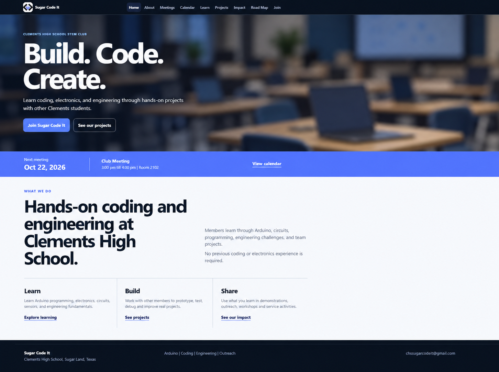

# Sugar Code It

Official website repository for Sugar Code It, a student-led STEM club at William P. Clements High School that teaches Arduino, programming, and engineering through hands-on projects.

**Live site:** [sugar-code-it.com](https://sugar-code-it.com)

---

## About the Club

Sugar Code It gives students a place to learn technical concepts and apply them right away. Meetings combine short lessons with project work, troubleshooting, and collaboration so members understand not only how something works, but how to build it themselves.

## About the Website

I built and maintain this site to keep the club's meetings, resources, projects, and updates organized in one place for current members and students interested in joining.

### Features

- **Calendar and meetings:** meeting dates, details, and attendance information
- **Learning resources:** Arduino, electronics, and programming material
- **Project pages:** engineering and bioengineering projects
- **Impact and history:** club activities and past work
- **Roadmap:** upcoming lessons and projects
- **Join page:** information for prospective members
- **Responsive design:** works across desktop and mobile devices

### Easy-to-update content

Meetings, projects, and other updates are loaded dynamically through PHP endpoints and JSON data files, making it easier to update site content without rebuilding each page manually.

## Tech Stack

| Layer | Technology |
|---|---|
| Front end | HTML, CSS, JavaScript |
| Back end | PHP endpoints |
| Data | JSON |
| Version control | Git and GitHub |

## Repository Structure

```text
api/            PHP endpoints used by the public website
assets/         Public website assets
data/           JSON files used for dynamic content

index.html      Home page
about.html      About the club
calendar.html   Club calendar
meetings.html   Meeting information
learn.html      Learning resources
projects.html   Club projects
impact.html     Club impact and activity history
roadmap.html    Future plans and project roadmap
join.html       Information for students interested in joining

styles.css      Shared styling
script.js       Shared JavaScript
```

## Running Locally

With PHP installed:

```bash
git clone https://github.com/mohidlatif/sugarcodeitclub.git
cd sugarcodeitclub
php -S localhost:8000
```

Then open `http://localhost:8000` in a browser.

This public repository intentionally excludes administrative, authentication, and private-upload files, so functionality that depends on those components is not included in the local public version.

## My Role

**Mohid Latif — Vice President & Webmaster**

I was elected Vice President at the end of the 2025–26 school year and continue to serve as Webmaster. My role includes club leadership, technical instruction, curriculum planning, and web development.

### Leadership and Instruction

- Help lead club planning and technical activities alongside fellow officers and our faculty sponsor
- Explain programming, Arduino, electronics, and engineering concepts before hands-on projects so members understand the ideas behind what they are building
- Guide members through project setup, programming, electronics, and troubleshooting as they work

### Curriculum

- Update and organize the **Sugar Code It syllabus and project curriculum**, including the order of lessons, technical topics, and hands-on projects throughout the year

### Web Development

- Design, build, and maintain the club website as Webmaster
- Expand the Bioengineering and project sections with new technical content and learning resources
- Keep meeting, event, and calendar content current
- Work with fellow officers and our faculty sponsor on technical documentation and member engagement

## Privacy

This repository contains only the public version of the website. Administrative files, authentication files, server configuration, logs, private uploads, and identifiable student photos are intentionally excluded to protect members' privacy.

---

**Sugar Code It**  
William P. Clements High School  
Sugar Land, Texas
